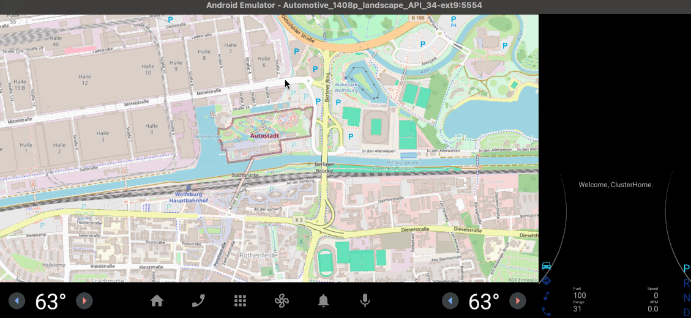

# AAOS Route Planner with OpenMapView

A modern Android Automotive OS (AAOS) route planning application built with Jetpack Compose and OpenMapView. Users can place start and finish markers on a fullscreen map, calculate routes using the public OSRM API, and view routes with automatic zoom-to-fit functionality.



## Completed Features

- Fullscreen map display using OpenMapView
- Touch-based marker placement for start and finish points
- OSRM integration for route calculation with error handling
- Visual route display with blue polyline rendering
- Auto-zoom to fit both markers and route with 1.3x padding
- Green and red markers for start and finish points
- State-managed floating action button (Cancel)
- Toast notifications for route info (distance and duration)
- Complete error handling and network timeout management

### Target Platform
- Minimum SDK: API 34 (Android 14)
- Target SDK: API 35
- Compile SDK: API 36
- Optimized for Google Pixel Tablet emulator with AAOS image

## Architecture

### Modern Android Stack
- **Jetpack Compose** - Declarative UI framework
- **OpenMapView** - Custom map library for Android (replaces osmdroid)
- **MVVM Pattern** - ViewModel with StateFlow for reactive state management
- **Coroutines** - Async operations for network calls
- **Ktor 3** - Modern async HTTP client with native Kotlin coroutines support
- **kotlinx.serialization** - Compile-time safe JSON serialization

### Core Components
1. **MainActivity** - ComponentActivity hosting Compose UI in DrivingRouteTheme
2. **MainScreen** - Composable UI with Scaffold, FloatingActionButton, and AndroidView for map integration
3. **MainViewModel** - State management with 6 StateFlows:
   - `appState`: Tracks interaction state through 4 states
   - `startMarker`: LatLng? for green start marker
   - `finishMarker`: LatLng? for red finish marker
   - `routePoints`: List<LatLng> for blue polyline
   - `routeInfo`: String? for distance/duration toast
   - `errorMessage`: String? for snackbar errors
4. **RouteRepository** - Ktor HttpClient with Android engine, 10-second timeouts, logging plugin
5. **OpenMapView Integration** - AndroidView wrapper with lifecycle observer, markers, polylines, and camera animations

### State Flow

```
IDLE -> START_MARKER -> FINISH_MARKER -> ROUTE_DISPLAYED
  ^          |               |               |
  +--------- CANCEL -------- CANCEL -------- CANCEL
```

- **IDLE**: No markers, Cancel FAB hidden, waiting for first tap
- **START_MARKER**: Green marker placed, Cancel FAB visible
- **FINISH_MARKER**: Red marker placed, route calculation starts
- **ROUTE_DISPLAYED**: Blue polyline shown, auto-zoom to fit, distance/duration toast

## Dependencies

The project uses Gradle version catalogs for dependency management. See `gradle/libs.versions.toml` for current versions.

### Key Libraries
- **OpenMapView** - Custom Android map library
- **Ktor Client** - Modern HTTP client for OSRM API
- **kotlinx.serialization** - Compile-time JSON serialization
- **Compose BOM** - Jetpack Compose UI components
- **Material3** - Material Design 3 components
- **Coroutines** - Async operations
- **Lifecycle** - ViewModel and lifecycle-aware components
- **Kotlin** - Primary language with JVM target 11

### Version Catalog Reference

Check `gradle/libs.versions.toml` for current dependency versions. Key sections:
- `[versions]` - Version numbers for all dependencies
- `[libraries]` - Library definitions with group/name/version references
- `[plugins]` - Gradle plugins (Android, Kotlin, Compose, Serialization)

### Permissions (AndroidManifest.xml)
```xml
<uses-permission android:name="android.permission.INTERNET" />
<uses-permission android:name="android.permission.ACCESS_NETWORK_STATE" />
<uses-permission android:name="android.permission.WRITE_EXTERNAL_STORAGE" />
```

## Build & Usage

### Prerequisites
- Android Studio (latest version)
- Android Automotive OS emulator or physical device
- Internet connection for OSRM API calls
- At least 4GB RAM allocated to Gradle (configured in `gradle.properties`)

### Environment Setup

If building from command line, set up your environment:

```bash
# Add to ~/.profile or ~/.bashrc
export JAVA_HOME=/snap/android-studio/current/jbr  # For snap installation
export PATH=$JAVA_HOME/bin:$PATH
export PATH=$PATH:$HOME/Android/Sdk/platform-tools

# Reload profile
source ~/.profile
```

**Note:** The project requires `gradle.properties` with AndroidX support and memory settings. This file is included in the repository.

### Building the App
```bash
# Build debug APK
./gradlew :automotive:assembleDebug

# Install to connected device/emulator
./gradlew :automotive:installDebug

# Run tests
./gradlew :automotive:test

# Run instrumentation tests
./gradlew :automotive:connectedAndroidTest
```

### How to Use
1. **Launch the app** - Fullscreen map loads centered on Wolfsburg
2. **Place start marker** - Tap anywhere on the map to place green start marker
3. **Place finish marker** - Tap again to place red finish marker and calculate route
4. **View route** - Blue polyline appears with auto-zoom and distance/duration toast
5. **Reset** - Tap Cancel FAB to clear markers and route, return to IDLE state

### Network Requirements
- App requires internet connection for route calculation
- Uses public OSRM API: `https://router.project-osrm.org/route/v1/driving/`
- 10-second timeout configured for network requests

## File Structure

```
automotive/src/main/kotlin/de/afarber/drivingroute/
├── MainActivity.kt                 # Compose entry point (18 lines)
├── model/
│   ├── AppState.kt                # 4-state enum for UI flow
│   ├── RoutePoint.kt              # Data class for route points
│   └── OSRMResponse.kt            # kotlinx.serialization data classes for OSRM API
├── network/
│   └── RouteRepository.kt         # Ktor HttpClient with plugins
├── ui/
│   ├── MainScreen.kt              # Compose UI with map, FAB, state handling
│   ├── MainViewModel.kt           # StateFlow-based state management
│   └── theme/                     # Color, Type, Theme definitions
└── utils/
    ├── PolylineDecoder.kt         # Google polyline algorithm (1e5 precision)
    └── MapUtils.kt                # Bounding box calculations with padding

automotive/src/main/res/
├── drawable/
│   └── ic_close.xml               # Cancel FAB icon
└── values/
    └── strings.xml                # App name and labels
```

## Implementation Details

### State Management (AppState.kt)
```kotlin
enum class AppState {
    IDLE,               // No markers, Cancel FAB hidden
    START_MARKER,       // Green marker placed, Cancel FAB visible
    FINISH_MARKER,      // Red marker placed, route calculation in progress
    ROUTE_DISPLAYED     // Blue polyline shown with auto-zoom
}
```

### Jetpack Compose Integration

**MainActivity.kt** - Simple entry point:
```kotlin
class MainActivity : ComponentActivity() {
    override fun onCreate(savedInstanceState: Bundle?) {
        super.onCreate(savedInstanceState)
        setContent {
            DrivingRouteTheme {
                MainScreen()
            }
        }
    }
}
```

**MainScreen.kt** - Manages UI and map integration using:
- `Scaffold` with `FloatingActionButton` and `SnackbarHost`
- `AndroidView` for OpenMapView integration
- `collectAsState()` to observe ViewModel StateFlows
- `LaunchedEffect` for side effects (toasts, snackbars)

**MainViewModel.kt** - Handles:
- Map click events and state transitions
- Route calculation with coroutines
- Error handling with Result<T> wrapper
- State exposure via StateFlow

### OpenMapView Integration

OpenMapView is integrated using `AndroidView` with proper lifecycle management:

```kotlin
AndroidView(
    factory = { ctx ->
        OpenMapView(ctx).apply {
            lifecycleOwner.lifecycle.addObserver(this)
            setZoom(15.0)
            setCenter(LatLng(52.4227, 10.7865))
            setOnMapClickListener { latLng -> onMapClick(latLng) }
        }
    },
    update = { mapView ->
        mapView.clearMarkers()
        mapView.clearPolylines()
        // Re-add markers and polylines based on current state
    }
)
```

**Key Points:**
- OpenMapView implements LifecycleObserver for proper lifecycle handling
- `update` block runs on every recomposition - must clear before re-adding
- Uses `BitmapDescriptorFactory.defaultMarker()` for colored markers
- Polyline strokeColor requires Int (not Compose Color)

### HTTP Client Implementation

**RouteRepository.kt** uses Ktor HttpClient with Android engine:

```kotlin
private val client = HttpClient(Android) {
    // Base URL configuration
    defaultRequest {
        url("https://router.project-osrm.org/")
    }

    // Content negotiation for JSON serialization
    install(ContentNegotiation) {
        json(Json {
            ignoreUnknownKeys = true
            isLenient = true
            prettyPrint = true
        })
    }

    // Logging plugin
    install(Logging) {
        logger = object : Logger {
            override fun log(message: String) {
                Log.d("KtorClient", message)
            }
        }
        level = LogLevel.BODY
    }

    // Timeout configuration
    install(HttpTimeout) {
        connectTimeoutMillis = 10_000
        requestTimeoutMillis = 10_000
        socketTimeoutMillis = 10_000
    }
}
```

**Key Features:**
- **Ktor Android Engine**: Native Android HTTP implementation
- **ContentNegotiation Plugin**: Automatic JSON serialization via kotlinx.serialization
- **Logging Plugin**: Logs requests/responses to logcat with "KtorClient" tag
- **HttpTimeout Plugin**: 10-second timeouts for connect/request/socket operations
- **Coroutines-First**: Built for Kotlin suspend functions from the ground up

### OSRM API Integration

**API Details:**
- **Base URL**: `https://router.project-osrm.org/`
- **Endpoint**: `route/v1/driving/{coordinates}`
- **Format**: `{lng1},{lat1};{lng2},{lat2}`
- **Timeout**: 10 seconds for all network operations
- **Serialization**: kotlinx.serialization with compile-time code generation
- **Error Handling**: Result<T> wrapper for success/failure handling

**Request Example:**
```kotlin
val response = client.get {
    url {
        path("route/v1/driving/$coordinates")
    }
}
```

### Polyline Processing
- Decodes OSRM polyline geometry using Google's algorithm
- Converts to `List<LatLng>` for OpenMapView rendering
- Handles precision scaling (1e5 factor) correctly
- Renders as blue polyline with 8f stroke width

## UI Implementation Details

### Floating Action Button
- **Position**: Bottom-right (end) with standard padding
- **Color**: Red background with white close icon
- **Visibility**: Hidden in IDLE state, visible in all other states
- **Behavior**: Clears all markers/routes and returns to IDLE state

### Map Configuration
- **Tile Source**: OpenStreetMap (default)
- **Initial Zoom**: Level 15.0
- **Initial Center**: Wolfsburg, Germany (52.4227, 10.7865)
- **Zoom Range**: 3.0-20.0 with multitouch enabled
- **Interaction**: Pan, zoom, pinch gestures fully functional

### Markers
- **Start Marker**: Green marker using `BitmapDescriptorFactory.HUE_GREEN`
- **Finish Marker**: Red marker using `BitmapDescriptorFactory.HUE_RED`
- **Placement**: Created via OpenMapView's Marker class
- **Lifecycle**: Cleared and re-added on state changes

### Route Polyline
- **Color**: Blue (defined as Int in theme/Color.kt)
- **Width**: 8f stroke
- **Auto-zoom**: 1.3x padding factor using MapUtils.createBoundingBoxWithPadding()
- **Animation**: Smooth camera transition via CameraUpdateFactory.newLatLngBounds()

## Testing & Quality

### Current Test Coverage
- **Unit Tests**: Located in `automotive/src/test/kotlin/` (JUnit)
- **Instrumentation Tests**: Located in `automotive/src/androidTest/kotlin/` (AndroidX Test + Espresso)
- **Manual Testing**: All core functionality verified on emulator

### Verified Functionality
1. **Happy Path**: Place Start -> Place Finish -> Calculate route -> Auto-zoom works
2. **Cancel Operations**: Cancel works in all states (START_MARKER, FINISH_MARKER, ROUTE_DISPLAYED)
3. **Map Interactions**: Pan, zoom, pinch gestures functional
4. **Network Handling**: Route calculation with proper error handling and timeouts
5. **State Management**: All state transitions work correctly
6. **Auto-zoom**: Proper bounding box calculation with 1.3x padding
7. **Markers**: Green/red markers render correctly
8. **Route Display**: Blue polyline renders with distance/duration toast

